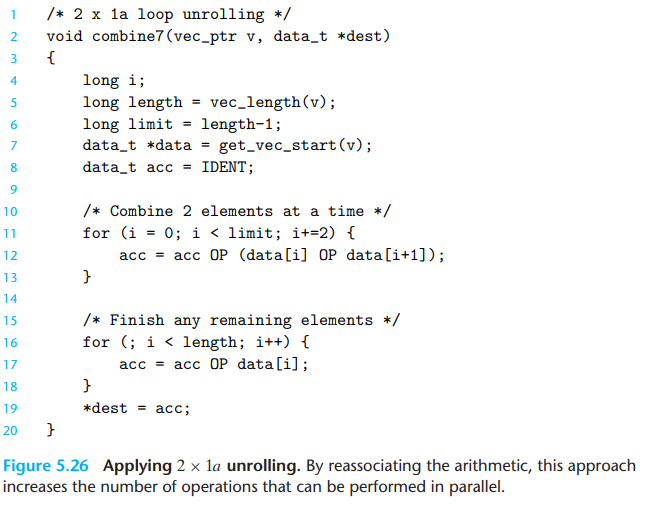
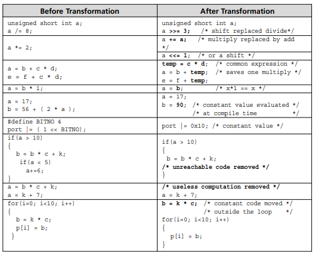
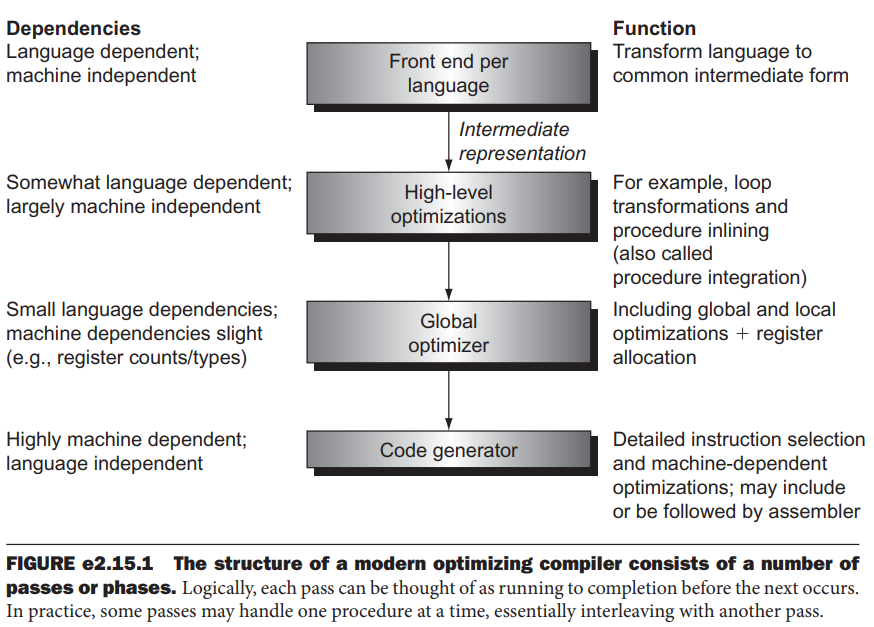

# Optimization

- Build optimization notes

## Index

- [Index](#index)
- [Branch Prediction](#branch-prediction)
- [Eliminating Unneeded Memory References](#eliminating-unneeded-memory-references)
- [Enabling Optimization](#enabling-optimization)
- [Flags](#flags)
- [Increment vs Decrement in For Loop](#increment-vs-decrement-in-for-loop)
- [Loop Unrolling, Reassociation](#loop-unrolling-reassociation)
- [Optimization Types](#optimization-types)
- [Repetitive Floating-Point Comparisons](#repetitive-floating-point-comparisons)
- [Steps](#steps)

## Branch Prediction

- Modern processors pipeline instructions to overlap instruction execution/loading, etc
- Each time there's a branch instruction (generated by `if`, `for`, `while`, `switch`, etc), the processor doesn't know what instructions to load until the condition is resolved
- Processors try to predict which instructions to load to minimize an empty pipeline
- Optimizing performance w/ branch prediction:
  - A regular function call (a direct call) and a call through a function pointer (an indirect call) are different:
    - Direct call
      - Fixed known target address- predictor can recognize and optimize
    - Indirect call
      - CPU only knows the target address at runtime, so the predictor has to guess where execution jumps
  - Excessive use of function pointers can slow execution due to branch prediction misses
- Move all processing to outside of conditional statements
  - By preparing all possible return results and operations before a conditional check, branch prediction miss penalties can be alleviated
  - ...the downside to this is that all that processing will always be done- average system performance may go down
  - So this is a desperate effort- otherwise we can go ahead and prioritize readability
- Dynamic branch prediction
  - Branch prediction using runtime information
  - May use a "branch prediction buffer" or implement some sort of "branch history table"

## Eliminating Unneeded Memory References

- Removing unnecessary accesses to RAM (output parameters, unnecessary updates in a loop, etc) saves time

## Enabling Optimization

- If code isn't working w/ compile-time optimization:
  - Variables modified in interrupts need to be volatile
  - Make sure all variables are initialized
  - Add space after arrays to check that there's no overflow errors
  - Slow down the system w/ delay calls to see if behavior changes
- -Og optimization
  - -O1 was as low as you could go until GCC version 4.8... Only then was -Og introduced

## Flags

- `-O0`
  - No optimization- keep code close to source for debugging
- `-O1`
  - Basic optimizations, minimal compile-time cost
- `-O2`
  - Adds most useful optimizations that don't violate correctness or standard compliance
- `-O3`
  - Aggressive optimizations like vectorization/loop unrolling
- `-Ofast`
  - Like `-O3`, but violate IEEE/ISO compliance (may cause unsafe math)
- `-Os`
  - Optimize for size
- `-Oz`
  - Clang only- even more aggressive optimization
- `-Og`
  - Optimize for debugging- don't hurt the debugging experience, but optimize a bit
  - Essentially includes most `-O1` optimizations except those that hurt debugging

## Increment vs Decrement in For Loop

- Comparison against 0 is faster than comparing to a numerical value, so it's ever so slightly faster to decrement in a for loop
- ...Readability is always priority, but if it doesn't matter then decrementing is good practice

## Loop Unrolling, Reassociation

- Loop unrolling
  - Reducing the number of iterations in a loop by increasing the number of elements computed on each iteration
  - Allows for better instruction parallelism inhibited from the loop's conditional check
- Reassociation
  - When arithmetic is reassociated so that some math is independent of other variables, independent work can be done in parallel
- 

## Optimization Types

- This is essentially a list of things we shouldn't worry about in source code
- _High-Level Optimizations_
  - **Constant folding / propagation**
    - Reduce expressions down to constants at compile time
    - `-O1`+
  - **Dead code elimination**
    - Remove code that doesn't affect program behavior
    - `-O1`+
  - **Strength reduction**
    - Replace expensive operations w/ cheaper equivalents (left shift in place of \*2, etc)
    - `-O1`+
  - **Inlining of small functions**
    - Replace function calls w/ function body
    - `-O1`+, aggressive at `-O2`, `-O3`
  - **Tail call elimination**
    - Replace recursive function calls w/ jump instruction to save stack space
    - `-O1`+
  - **Loop invariant code motion**
    - Aka, hoist expressions outside loops
    - Move calculations that don't change to outside the loop
    - `-O2`+
  - **Common subexpression elimination**
    - Reuse result of identical computations w/in a scope
    - `-O1`+
  - **Simplification of algebraic identities**
    - Reduce algebraically identical expressions (multiply by 1 or 0, add 0, etc)
    - `-O1`+
  - **Branch simplification**
    - Simplify conditional statements w/ known outcomes (if(true) deleted)
    - `-O1`+
  - **Switch statement lowering**
    - Replace large `switch` statements w/ jump tables or binary search
    - `-O2`+
- _Global Optimizer_
  - **Register allocation**
    - Map variables to CPU registers instead of main memory
    - `-O1`+
  - **Loop unrolling**
    - Duplicate loop body multiple times to reduce iterations needed
    - `-O3`
  - **Loop peeling / splitting**
    - Extract a few iterations, or split a loop into multiple parts to handle edge cases separately
    - This simplifies the main loop body for vectorization / alignment
    - `-O2`+
  - **Loop interchange / fusion**
    - Loop interchange
      - Swap loop nesting order to improve memory locality
      - `-O3`
    - Loop fusion
      - Merge adjacent loops over the same range
      - `-O3`
  - **Vectorization**
    - Replace scalar operations w/ SIMD
    - Allows for data-level parallelism
    - `-O3`
  - **Partial redundancy elimination**
    - Remove computations that are redundant even if the redundancy is applicable for just some paths
    - `-O2`+
  - **Global common subexpression elimination**
    - Reuse results of repeated expressions across basic blocks and functions across an entire program
    - `-O1`+
  - **Interprocedural constant propagation**
    - Regular constant propagation replaces all variables w/ constants w/in a single function if they don't change
    - "interprocedural constant propagation" applies the concept for when a function is always passed the same parameter- parameter can be replaced w/ a constant w/in the function
    - `-O2`+
  - **Interprocedural dead code elimination**
    - Remove dead code across the whole program
    - `-O2`+
  - **Inlining heuristics**
    - Apply heuristics to decide when to inline functions based on size, call frequency, etc
    - Balances performance vs code bloat
    - `-O2`+
  - **Profile-guided optimizations**
    - Runtime profiling as a "training run"- guides optimization
    - Hot functions close together, optimize branch prediction, etc
    - `-fprofile-generate`, `-fprofile-use`
  - **Link-time optimization**
    - Optimize across compilation units at link time
    - Inlining, dead code elimination, etc at link time across various `.o` files
    - `-flto`
  - **Code layout optimizations**
    - Reorder functions/basic blocks for better cache/branch prediction
    - Moving infrequent code elsewhere, etc
    - `-O2`+, with PGO
- _Target-Specific / Low-Level Optimizations_
  - **Value promotion/demotion**
    - Extending/narrowing variables to match the native width for an architecture
    - `-O0`+, so it always happens- no need to mask data types w/ ugly macros no sirr
  - **Instruction scheduling**
    - Reorder instructions to reduce CPU pipeline stalls
    - Increases instruction-level parallelism
    - `-O2`+
  - **Instruction selection / peephole optimizations**
    - Instruction selection
      - Choose efficient instructions to implement IR operation (shifts instead of multiply, etc)
    - Peephole optimization
      - Other small assembly instruction optimizations
    - `-O1`+
  - **Branch prediction hints**
    - Use heuristics to annotate likely/unlikely branches
    - `-O2`+
  - **Frame pointer omission**
    - Skip creating a frame pointer if stack layout is simple
    - Frees up a register in exchange for debugging difficulty
    - `-fomit-frame-pointer`, `-O1` on some architectures
  - **Inlining assembly idioms**
    - Replace common function calls w/ inline assembly instructions
    - `-O2`+
  - **Strengthened addressing modes**
    - Make use of complex addressing modes provided by an ISA to fold instructions sequences
    - `-O2`+
- Examples:
  - 

## Repetitive Floating-Point Comparisons

- Floating-point comparison instructions set 3 condition codes:
  - Zero flag
  - Carry flag
  - Parity flag
- 
  - Unordered case occurs when either operand is NaN
- Spamming relational operators on floating point values is inefficient/redundant, because of the assembly instructions that floating-point comparisons break down to
  - Constantly comparing variables to 0.0, generating floating point constant 0.0
- Try to minimize if possible

## Steps

- 
- Front end
  - Scanning
    - Read all individual characters and create a string of tokens
  - Parsing
    - Take the token stream and check for syntax
    - Produce an "abstract syntax tree"
  - Semantic analysis
    - Take the abstract syntax tree and check for semantic correctness (operator/operand type checking, and symbol table generated to further type check)
  - Generation of intermediate representation
    - Take the symbol table and abstract syntax tree and generate an intermediate representation as the output of the front end
    - May assume infinite virtual registers, or make other assumptions to be ironed out later
- High-level optimizations
  - As in, at the source level rather than individual assembly instruction optimizations
  - Most common is procedure inlining and loop unrolling
- Local/global optimizations
  - Local optimization
    - Works w/in a single "basic block" (block of assembly instructions w/o a branch label)
    - Precursor/successor to global optimization for before & after "clean-up"
    - Common subexpression elimination, etc
  - Global optimization
    - Works across multiple basic blocks
  - Global register allocation
    - Allocates variables to registers for regions of code
    - "Regions" (a section of code w/ variables could be allocated registers) are iterated through:
      - Definition/change of a variable in a basic block and add the block to a region
      - Find uses of the definition, and add basic blocks that contain uses as well as basic blocks that pass the value through to reach a use to the region
      - Find other definitions that also affect a use found in previous steps and add basic blocks containing those definitions as well blocks that pass through to reach a use to the region
      - Repeat above 2 steps until convergence
      - If the designated variable is allocated to a register in all basic blocks, then there's no need for load/store of the variable to/from main memory
- Code generation
  - Filling in symbolic values, generating binary code
