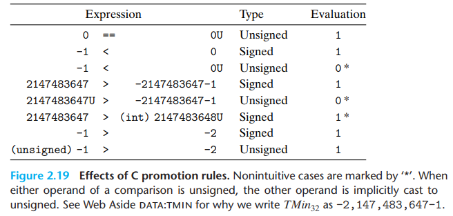
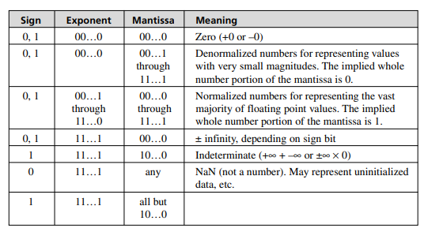
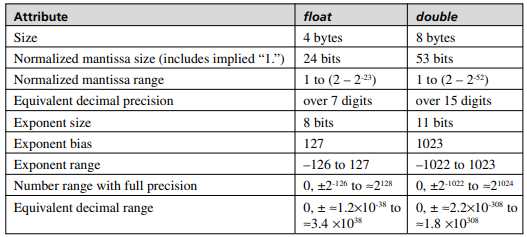

# C Undefined Behavior

- Undefined behavior in C notes

## Index

- [Index](#index)
- [\_\_attribute\_\_](#attribute)
- [Casting](#casting)
- [Character Sign](#character-sign)
- [Compiler Defined Constants / Functions](#compiler-defined-constants--functions)
- [Expression Term Evaluation Order](#expression-term-evaluation-order)
- [Forgetting a Return Value](#forgetting-a-return-value)
- [Implicit Casting, Integral Promotion](#implicit-casting-integral-promotion)
- [Mixing Signed and Unsigned](#mixing-signed-and-unsigned)
- [Overflow, Underflow](#overflow-underflow)
- [Primitive Data Type Sizes](#primitive-data-type-sizes)
- [Returning a Stack Address](#returning-a-stack-address)
- [Right Shifting](#right-shifting)
- [Shifting by Too Much](#shifting-by-too-much)
- [Type Qualifiers and Operations](#type-qualifiers-and-operations)

## \_\_attribute\_\_

- “Compiler extension” / keyword to specify special properties for functions, variables, structures, types
- Associated behavior isn't standardized- it's compiler specific
- Function attributes
  - `void fatal_error() __attribute__((noreturn));`
    - Indicates that the function never returns
  - `void log_message(const char *fmt, …) __attribute__((format(printf, 1, 2)));`
    - Checks for whether log_message follows printf-style formatting rules
- Variable attributes
  - `int my_var __attribute__((aligned(16)));`
    - Specifies memory alignment for variable
- Typedef attributes
  - `struct __attribute__((packed)) PackedStruct { char a; char b; };`
    - Removes padding in structs
- Exhaustive list:
  - Function attributes
    - `noreturn`
      - Indicates that function never returns
    - `deprecated`
      - Issues a warning if function is used
    - `format(printf, x, y)`
      - Checks for printf-style format specifiers for correctness
    - `always_inline`
      - Forces compiler to inline a function
    - `noinline`
      - Prevents compiler from inlining a function
    - `cold`
      - Optimizes function for infrequent execution (error handling, etc)
    - `hot`
      - Optimizes function for frequent execution
    - `pure`
      - Declares that a function doesn’t modify global state (no side effects)
      - No modifying global/static variables, no IO operations, always same output for the same input regardless of changes in global state
    - `const`
      - Declares that function has no side effects (only depends on input arguments)
    - `malloc`
      - Declares that function returns pointer to newly allocated memory
    - `aligned(x)`
      - Specifies function alignment in memory
    - `visibility(“hidden”)`
      - Controls symbol visibility
      - Good for shared libraries
    - `section(“name”)`
      - Places function in specific section of binary
    - `constructor`
      - Marks function to run before main()
    - `destructor`
      - Marks function to run after main() or exit()
    - `weak`
      - Declares weakly linked function
    - `alias(“other_function”)`
      - Creates an alias for another function
    - `used`
      - Prevents compiler from removing function definition even if the function isn’t used
  - Variable attributes
    - `aligned(x)`
      - Ensures variable is aligned to at least x bytes
    - `packed`
      - Prevents padding in structures
    - `deprecated`
      - Issues warning if variable is used
    - `unused`
      - Prevents warning if variable is declared but not used
    - `weak`
      - Declares weakly linked variable
    - `section(“name”)`
      - Places variable in specific memory location
    - `visibility(“hidden”)`
      - Hides symbol from shared libraries
    - `tls_model(“model”)`
      - Specifies TLS (“thread local storage”) model
    - `used`
      - Prevents compiler from removing variable even if the variable isn’t used
  - Typedef attributes
    - `packed`
      - Removes padding in structures
    - `aligned(x)`
      - Ensures a type is aligned to at least x bytes
    - `transparent_union`
      - Allows automatic type conversion for union elements
    - `deprecated`
      - Issues a warning if type is used
    - `may_alias`
      - Prevents aliasing issues in strict aliasing mode
    - `warn_unused_result`
      - Issues warning if function return value is ignored

## Casting

- Casting hides undefined/unintuitive behavior...
- `void *` casts
  - These are all safe, for as long as you're casting to and from the original type
  - Otherwise, behavior is undefined
- Numerical values
  - Int to float
    - Can't overflow, but may be rounded
  - Int/float to double
    - Can't overflow, and numeric value can be preserved
    - Double has both greater precision and range
  - Double to float
    - Value can overflow to +/- infinity
    - Otherwise rounded
  - Float/double to int
    - Rounded toward zero
    - Value can overflow and C doesn't define overflow behavior this way
  - Constant literals
    - Constant literal casts are implementation dependent, since a constant can be interpreted as either 2's complement or not
- Pointers of unrelated types
  - Legal, but dereferencing the casted pointer causes undefined behavior
- Function pointer casts
  - Legal, but causes undefined behavior on the call
- Getting rid of type qualifiers
  - Legal and dangerous- undefined behavior if you modify the object
- Different struct types
  - Only safe if first members are compatible, or if you don't ever dereference
  - ...don't do it
- "type conversion" vs "type disambiguation"
  - A cast is a type conversion if actual bits change
  - A cast is a type disambiguation if the compiler can inject the correct bits to begin with
  - ...The issue is that half the time you don't know which is which because casting behavior isn't intuitive

## Character Sign

- Characters can either be signed or unsigned- it's implementation specific

## Compiler Defined Constants / Functions

- Compiler-defined macros- not safe/portable to use
- **Macros**
  - Preprocessor conditionals and versioning
    - `__GNUC__`, `__GNUC_MINOR__`, `__GNUC_PATCHLEVEL__`
      - Indicate version of GCC being used
    - `__clang__`
      - Defined when Clang is being used
    - `__MINGW32__`
      - Defined when MinGW is being used
  - Architecture-specific macros
    - `__x86_64__`, `__amd64__`
      - Defined when compiling for 64-bit x86 architecture
    - `__i386__`, `i686__`
      - Defined when compiling for 32-bit x86 architecture
    - `__arm__`, `__aarch64__`
      - Defined when compiling for ARM architecture
    - `__mips__`
      - Defined when compiling for MIPS architecture
    - `__powerpc__`, `__ppc__`
      - Defined when compiling for PowerPC architecture
  - Platform-specific macros
    - `__WIN32__`, `_WIN32`
      - Defined when compiling for Windows platforms
    - `__APPLE__`
      - Defined when compiling on macOS
    - `__linux__`
      - Defined when compiling for Linux platforms
    - `__unix__`
      - Defined when compiling on any Unix-like platforms
    - `__ANDROID__`
      - Defined when compiling for Android platforms
  - Optimization macros
    - `__OPTIMIZE__`
      - Defined if compiler is performing optimizations
    - `__NO_INLINE__`
      - Defined if function inlining is disabled by the compiler
    - `__INLINE__`
      - Defined if function inlining is enabled
  - Memory related macros
    - `__near`, `__far`, `__restrict`
      - Used in 16-bit compilers to specific near/far memory models for pointers
- **Functions**
  - `__builtin` functions
    - Provided by GCC/Clang compilers for performance/optimization purposes

## Expression Term Evaluation Order

- If you have something like:
- `x = f() + g() * h();`
- Function call order is undefined
- That's to say that the order in which expression terms themselves are evaluated is (most of the time) undefined
- The 3 functions can be called in any order- the order of operations w/ each of the returned values is what's deterministic

## Forgetting a Return Value

- If you forget to return a value in a function definition, the compiler will throw a warning
- If you go ahead and ignore the warning, you'll get a project w/ undefined behavior

## Implicit Casting, Integral Promotion

- > Operands with different types get converted when you do arithmetic. Everything is converted to the type of the floatiest, longest operand, signed if possible without losing bits
  - _Deep C Secrets_
  - > In English (complete with loopholes and lack of precision)
- Primitive data types are implicitly casted/promoted to larger types if comparisons, assignments, function calls are made w/ a smaller primitive data type than what’s expected
  - Need to be careful- there can be implicit casting from signed to unsigned if the unsigned data type is larger than the signed data type- NOT SAFE; causes implementation specific behavior
- When casting to a smaller size type, all excessive significant bits are truncated, then the type is changed
- When casting to a larger size type, C defines the size change to happen first, then the type change:

```
short sx = -12345;     /* 16 bits */
unsigned long uy = sx; /* 32 bits: sx is first expanded to 32 bits w/ sign extension, then converted to unsigned long type */
                       /* uy =  4,294,954,951 instead of 53,191 */
```

- Types smaller than `int`
  - Implicit integral promotion is applied to convert values to `int`s if all values representable by the original type can be represented by an `int` (otherwise, it's promoted to `unsigned int`)
    - For `char`, `signed char`, `unsigned char`, `short`, `unsigned short`, `enum`, and bit-fields smaller than `int`, the above applies
  - Integral promotion happens before:
    - Arithmetic or bitwise operations
    - Relational and equality operators
    - Conditional expressions
    - Function calls for old-style functions or variadic arguments
  - ...they don't happen for:
    - Assigning to smaller types
    - Taking address of the object
    - Using `sizeof` or `_Alignof`
- Floating point and doubles are exceptions:
  - Function calls without prototypes are all promoted to doubles (though prototype-less functions are legacy now)
  - Arguments to variadic functions (`printf`, etc) are automatically promoted to double
  - Arithmetic operations involving only floats are usually done w/ floats only, but sometimes promoted to doubles on old C89 compilers
- `sizeof`
  - `size_t` is `unsigned int`
  - Comparing signed values to `sizeof`'s return value generates unintuitive behavior
- Just make everything signed
  - ...There's a philosophy to just keep everything signed since it's the superset numerically
  - The tradeoff is that signed values are implementation specific, and have quirky bitwise behavior...

## Mixing Signed and Unsigned

- When relational operators are used between a signed and unsigned value, results are unintuitive:
- 
- Make sure to cast as intended before comparing
  - ...or better yet, if a value can be operated on signed values (whether it's arithmetic or relational operators), probably best to start as signed

## Overflow, Underflow

- Signed integers
  - Overflow and underflow behavior are both undefined- there's no guarantee whether values will wrap or not
  - C doesn't require 2's complement, so implementations could trap values or implement 1's complement
- Unsigned integers
  - Unsigned values wrap both above max and below 0
- Floating point numbers
  - Overflowing past the floating point max results in + or - infinity
  - Underflowing below the smallest representable number can result in a "subnormal" number (reduced precision but not 0) or 0.0 if smaller than subnormal
  - 
  - 

## Primitive Data Type Sizes

- The size of primitive data types aren't defined by the C standard
- For both C/C++, all that's defined is the size relationship and minimum widths:
  - `char` <= `short` <= `int` <= `long` <= `long long`
  - `char`: 8 bits min
  - `signed char`: 8 bits min
  - `unsigned char`: 8 bits min
  - `short`: 16 bits min
  - `int`: 16 bits min, usually 32 bits
  - `long`: 32 bits min, 32 bits on Windows 64-bit, 64 bits on Linux/macOS 64-bit
  - `long long`: 64 bits min
  - `float`: n/a, but 6 decimal digits precision min
  - `double`: n/a, but 10 decimal digits precision min
  - `long double`: >= `double` precision
  - `void*`: >= 16 bits
- Sizes are also set in stone depending on OS (Windows, Linux, macOS, etc), but the point is that sizes can vary and there are set minimum sizes defined by the standard

## Returning a Stack Address

- Don't return addresses on stack (aka, temporary variables created in functions)
- There might or might not be a fault- it depends on when the stack frame is lost

## Right Shifting

- The C standard doesn't specify how to implement a right shift for signed numbers...
- Result could either be arithmetic or logical shift
- If you do perform arithmetic right shift, integers are rounded down instead of towards 0 (makes sense- lsb is truncated)

## Shifting by Too Much

- The C standard doesn't define behavior when more than the number of bits in an object are shifted away
- Many machines don't even look past the bit value that indicates the number of bits that make up the object being shifted, but it's not guaranteed
- Make sure to shift less than the word size
- This is the case for both left and right shifting

## Type Qualifiers and Operations

- Includes `const`, `volatile`, `restrict`, and `_Atomic`
