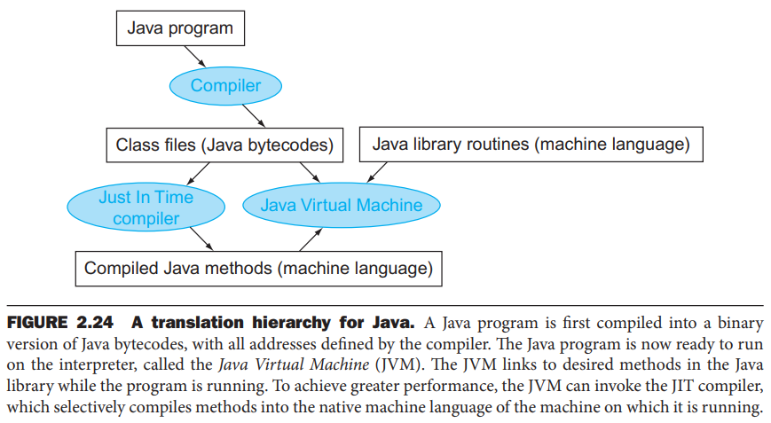

# Software Wide Concepts

- Software wide concepts notes
- General software concepts that are relevant across all languages

## Index

- [Index](#index)
- [Attribute/Field vs Element](#attributefield-vs-element)
- [Business logic](#business-logic)
- [Code, Firmware, Software, Applications](#code-firmware-software-applications)
- [Compound Statements](#compound-statements)
- [Computer Science](#computer-science)
- [Cookies](#cookies)
- [Definition vs Declaration](#definition-vs-declaration)
- [DSA](#dsa)
- [Flow Control, Control Flow](#flow-control-control-flow)
- [Foo and Bar](#foo-and-bar)
- [Forward vs Backslash](#forward-vs-backslash)
- [Free Field Language](#free-field-language)
- [Halting Problem](#halting-problem)
- [Hoinky](#hoinky)
- [IDE](#ide)
- [Index of Symbols](#index-of-symbols)
- [kb vs KB](#kb-vs-kb)
- [KV Store](#kv-store)
- [Lexical Scope](#lexical-scope)
- [Lexical vs Dynamic Scope](#lexical-vs-dynamic-scope)
- [Library, Toolkit, Framework](#library-toolkit-framework)
- [Linked Lists](#linked-lists)
- [Lvalue](#lvalue)
- [Method vs Function](#method-vs-function)
- [NP-Hardness](#np-hardness)
- [OTA, FWUP, DFU](#ota-fwup-dfu)
- [Overriding vs Overloading](#overriding-vs-overloading)
- [Package Manager](#package-manager)
- [Precondition, Postcondition](#precondition-postcondition)
- [Priori, Posteriori](#priori-posteriori)
- [Procedures, Subroutines, Functions](#procedures-subroutines-functions)
- [Program Object](#program-object)
- [Programming Definition](#programming-definition)
- [Programming Paradigms](#programming-paradigms)
- [Pure Code](#pure-code)
- [QoS](#qos)
- [Recursion Types](#recursion-types)
- [Rust & Zig](#rust--zig)
- [Scripts vs Programs](#scripts-vs-programs)
- [Software -> Machine Code](#software---machine-code)
- [Statement, Expression](#statement-expression)
- [String Interning](#string-interning)
- [Strongly vs Weakly Typed Languages](#strongly-vs-weakly-typed-languages)
- [Systems Software](#systems-software)
- [Turning Complete](#turning-complete)
- [WYSIWYG](#wysiwyg)

## Attribute/Field vs Element

- A variable in a C struct is called an “element”
- A variable in a Java class is called a “field” or “attribute” (“field” more commonly used)

## Business logic

- Rules, calculations, and operations defining how a software application processes data and behaves w/ respect to real-world business requirements
- UI, data access, etc are separate from business logic

## Code, Firmware, Software, Applications

- Code
  - Refers to human readable instructions written in a programming language to be compiled and loaded to some kind of hardware
  - Abstract reference of algorithms and logic written out in text to be executed by hardware
- Software
  - Collection of programs, data, and instructions to have computers execute algorithms
- Firmware
  - Specific type of software to be stored in non-volatile memory within hardware
  - Embedded software written for MCU’s and other hardware
  - Tied to the hardware that the software runs on- low level software
  - Subset of software
- Application
  - Programs written to perform specific tasks
  - Subset of software
- FPGA confusion
  - What you write in HDL’s is considered “code”, but it’s not firmware
  - HDL code is synthesized to create a “netlist” (representation of circuit in gates/FF’s) -> components placed on FPGA -> routed w/ wires to perform logic

## Compound Statements

- A bunch of statements surrounded by curly braces is called a “compound statement”
- A compound statement is evaluated as a single statement

## Computer Science

- The study of algorithms and their effectiveness in creating systems and applications

## Cookies

- We see "cookies" being used here and there, whether it's your web browser saving data or in a file management scheme
- Originates from how UNIX / ARPANET systems in the 1970s used the "magic cookie" term to refer to a small piece of data exchanged between programs to identify a session or context
- ...Still doesn't explain why "cookie" is the word that's used...

## Definition vs Declaration

- Definition
  - Providing full implementation of a body / entity
  - Variable initialization w/ declaration, flushed out function definition, etc
- Declaration
  - Introducing just the name of a body / entity without full details
  - Function prototype, variable declaration without initialization

## DSA

- “data structures and algorithms”

## Flow Control, Control Flow

- “Flow control” and “control flow” are often used synonymously, but:
  - Flow control
    - Refers to managing data transfer between to devices
    - As in software/hardware flow control in serial communication
  - Control flow
    - Refers to the order in which code is executed in a program
    - Aka "flow of control", or "control transfer"
      abrupt changes in control flow are called "exceptional control flow"- aka "exceptions"

## Foo and Bar

- We see this everywhere, we look up what it means, we forget, and it never makes any sense
- “foo” is a nonsense word used as a placeholder
- Originates from a comic strip called “Smokey Stover”
- “bar” is just a random word to follow along w/ “foo”
  - Bar is the word that was chosen to follow foo for the FUBAR acronym that was used in WWII (“f\*\*\*ed up beyond all recognition”)

## Forward vs Backslash

- `/` : forward slash
  - Used by Unix-like systems like Linux and GNU as a separator for directories
  - Follows POSIX
- `\` : backslash
  - Used by Windows as a separator for directories
  - Used to avoid conflict w/ delimiter parameters that include forward slashes like /w

## Free Field Language

- Programming languages where code placement doesn't matter- non-position.column dependent/sensitive
  - C, Python, Java
- "Fixed field languages" demand specific column positions
  - Columns in FORTRAN have specific meaning

## Halting Problem

- Refers to Alan Turning's proof that there's no general algorithm to verify whether a program runs forever
- ...So we probably won't have compilers w/ general algorithms that provide us w/ runtime logical errors before actually running a program

## Hoinky

- ...Very rarely angled brackets `<` and `>` can be referred to as left and right "hoinkies"
  - _Computer Systems: A Programmer's Perspective_

## IDE

- "integrated development environment"
- The same IDE everywhere
  - Eclipse based
    - MCUXpresso
  - Visual Studio based
    - Microchip Studio
  - JetBrains
    - Xilinx's Vitis, Pycharm, etc

## Index of Symbols

- When an IDE prompts that "indices are being updated", it refers to the index of symbols for your project
- An "index" is a data structure or metadata that allows fast lookup of information
- IDEs have an index of symbols (functions, classes, variables, macros) for a user to quickly "got to definition" or "find references", to highlight syntax, and to let refactoring tools do their job
- The may be internal to a workspace, or stored in a `.idx` file (often the case for JetBrains IDEs)

## kb vs KB

- ...thought casing matters, but it doesn't
- Formally:
  - K, M, G are base 10
  - Ki, Mi, Gi are base 2
- In practice:
  - Hardware specs
    - RAM, caches, etc
    - KB/MB/GB usually base 2
  - Storage devices
    - HDDs, SSDs, USB, etc
    - GB/TB usually base 10 (so SI)
    - ...thus when you check how much storage a device provides, it'll disappoint you bc your OS reports storage size in binary
  - Networking
    - Always base 10
    - "100 Mbps ethernet" is base 10
  - Operating systems / software
    - Linux is pretty good w/ using KiB/MiB
    - Windows/macOS will use KB/MB when they mean binary

## KV Store

- "key-value store"
- Associating values (string, number, etc) to a key (name, ID, etc) for fast data access
- You can associate addresses in memory w/ data stored in each address for fast access, but adding a key layer on top of addresses allows you to associate non-address values to data

## Lexical Scope

- Scope where identifier is understood and used w/o external linkage

## Lexical vs Dynamic Scope

- Lexical scope
  - Scope (region of source code) where identifier visibility is defined by textual structure rather than runtime behavior
  - Scope fixed at compile-time
  - C is lexically scoped
- Dynamic scope
  - When name resolution depends on call stack at runtime
  - Applies to old Lisp variants, etc

## Library, Toolkit, Framework

- Library
  - A collection of prewritten functions, classes, or utilities to call in your code
- Toolkit
  - A set of libraries/utilities grouped together for a specific domain or purpose
- Framework
  - A structured foundation for building applications, enforcing design patterns and architecture
  - Ie, Espressif's Integrated Development Framework (in place of an IDE)

## Linked Lists

- Practical applications include:
- Dynamic memory management
  - Merging free blocks of memory, keeping track of free memory
- Stack/Queue implementation
- Undo/redo functionality
- Hash table implementation
- Graph adjacency lists
  - Network routing algorithms, compilers for control flow graphs, AI path finding
- OS kernel structures
  - Task control like ready/waiting lists
  - Driver device queues
  - Process management lists
  - Interrupt/deferred service queues
- Audio/video buffers and streaming
  - DSP systems, media players, real-time communication software

## Lvalue

- “local value”, or "left value"
- Refers to a location in memory and an object that persists beyond a temporary expression
- `int x = 10;` <- x is an lvalue…

## Method vs Function

- A “function” is an abstraction for a block of code that performs a single task- written independent of classes
- A “method” is a function written for a particular class

## NP-Hardness

- "nondeterministic polynomial time hardness"
- Refers to whether problem solution can be verified in some polynomial time quickly
- So whether solution verification grows exponentially w/ the problem set
- Categories:
  - NP
    - Problem has solutions that can be verified quickly
    - Ex: sudoku, traveling salesman, hamiltonian path (is there a path where all nodes are visited just once)
  - NP-hard
    - Problems that are at least as hard as NP, and not necessarily verifiable quickly
    - Ex: optimization TSP, Turning's halting problem, scheduling, compiler optimization, circuit design layout
  - NP-complete
    - Problems that are in both NP and NP-hard
    - Ex: partition problems (load balancing, circuit partitioning), graph coloring (register allocation w/ compilers)

## OTA, FWUP, DFU

- OTA
  - "over-the-air update"
- FWUP
  - "firmware update"
- DFU
  - "device firmware update"

## Overriding vs Overloading

- Overloading
  - Overloading is when a function is defined multiple times but with different signatures (different parameter types or different number of parameters)
  - Python doesn’t directly support overloading like Java, but default parameters establish the same idea
  - C++ does support overloading just like Java
  - C doesn’t support overloading
- Overriding
  - Overriding is when a subclass of a class redefines a method w/ same signature
  - Python, Java, C++ support overriding

## Package Manager

- A package is just a set of files grouped by functionality
- Package managers install and manage packages
- Packages that are already locally available on a cache don't need installation, but packages are installed over a network otherwise

## Precondition, Postcondition

- Precondition is a condition/assumption that must be true before a function/method is called for it to work correctly
- Postcondition is a condition that has to be true after the function/method finishes, assuming preconditions were met

## Priori, Posteriori

- Comes up in a context dealing w/ learning or accumulation of info
- Priori refers to something known or assumed before experience/observation
- Posteriori refers to things learned after experience/observation

## Procedures, Subroutines, Functions

- They're all synonymous in modern programming, but historically:
- Procedure
  - No return value- just perform actions
  - From "structured programming" era
  - Pascal, Ada, BASIC
- Subroutine
  - May/may not return a value
  - First term used to refer to a named compound statement w/ defined arguments
  - Assembly, Fortran, COBOL
- Function
  - May/may not return a value
  - What we have now to refer to modular blocks of statements

## Program Object

- Any named entity in a program that the compiler or runtime system recognizes and manages
- So the partitions of memory created by the runtime system to manage program data, instructions, and control information
- Can include variables, functions, types, constants, modules/namespaces, instances of objects/classes, etc

## Programming Definition

- > We will never be rid of code, because code represents the details of the requirements. At some level those details cannot be ignored or abstracted; they have to be specified. And specifying requirements in such detail that a machine can execute them is programming. Such a specification is code.
  - Robert C. Martin in _Clean Code: A Handbook of Agile Software Craftsmanship_
- > We need to keep in mind that all living languages, both natural and synthetic, must evolve or perish
  - Cris Kobryn in _UML Distilled_
- > Language shapes the way we think, and determines what we can think about
  - B.L. Whorf
- > The purpose of a programming language is to help express ideas in code. In that, a programming language performs two related tasks: it provides a vehicle for the programmer to specify actions to be executed by the machine, and it provides a set of concepts for the programmer to use when thinking about what can be done.
  - Bjarne Stroustrup in _The C++ Programming Language_
- > In practical programming, there is little advantage in knowing the most obscure language features or using the largest number of features. A single language feature in isolation is of little interest. Only in the context provided by techniques and by other features does the feature acquire meaning and interest.
  - Bjarne Stroustrup in _The C++ Programming Language_

## Programming Paradigms

- Procedural
  - Language made for users to organize and execute tasks in a sequence of procedures/routines to run tasks step-by-step
  - Focused on processing and design of data structures
  - C, Pascal, Fortran, Algol
- Functional
  - Language made for users to write in an immutable way to represent software as the evaluation of mathematical functions
  - Avoids side effects; uses higher order functions, lambda expressions, and recursion
  - Haskell, Lisp, Scala, OCaml
- Object-oriented
  - Language made for users to encapsulate, organize, and abstract behavior using classes
  - Java, C++, Python

## Pure Code

- Used sometimes to refer to code that doesn't have static or initialized data
- Code that doesn't need to be modified to be executed by any specific process
- Pure code can safely be shared by different processes
- In C++, some pure code can be abstracted to `constexpr` functions (pure functions) for the compiler to optimize and reduce down to values

## QoS

- "quality of service"
- Mechanisms to ensure that data/tasks get priority, bandwidth, delay, and reliability in a system
- Comes up in networking / OS context
- Networking
  - Mechanisms to manage network traffic so critical / latency-sensitive applications get better treatment
- OS
  - Guaranteeing timing and performance constraints for processes / data streams

## Recursion Types

- Linear recursion
  - Only one call is made to the function w/in the function
- Tail recursive
  - When the recursive call is the last thing done by the function
  - Can be implemented w/ iteration instead
- Binary recursive
  - Calls itself twice during its execution

## Rust & Zig

- Both Rust and Zig are modern languages that build on procedural concepts at its core, but with added memory management features for protection and OOP aspects
- Both code in Rust and Zig compile down to C first before compiling down to machine code
- Rust
  - Implements memory safety/concurrency through ownership model and borrow checker- prioritizes memory safety
  - Implements “result” and “option” for explicit error handling
  - Objective is to provide a memory safe version of C/C++
  - A lot of support from large companies, suited for complex high level tasks
- Zig
  - Provides a lightweight error handling system by building it into the type system- “error unions”
  - Supports compile-time execution for optimal data structure generation and code optimization
  - Objective is to provide a modern C- gives user control of everything w/ minimal syntax and modern features
  - Very fast compilation times
  - Ideal of embedded systems for its low level control

## Scripts vs Programs

- Script
  - A script is a set of human-readable commands that are interpreted by an interpreter
  - Python is a "scripting language", and a "programming language"
  - Others include Perl, Python, Ruby
- Program
  - In contrast to a script, a program can refer to compiled software as well as interpreted software
  - C/C++, Pascal, etc are "programming languages"
  - Scripts are programs too, provided "programming" refers to how we specify tasks for a machine to do

## Software -> Machine Code

- Interpreted
  - Code is executed line by line w/ an interpreter at runtime
  - Slower due to translation at runtime
  - Portable due to lack of platform-specific compilers
  - Ex: Python
  - Executables generated for programs in interpreted languages include the interpreter and needed libraries along w/ your program
- Compiled
  - Code is translated to machine code before execution
  - Faster due to translation before runtime
  - Less portable- requires recompilation for each target platform
  - Ex: C, C++, Java, Rust
- JIT
  - “Just-in-time” languages
  - Languages that both interpret at runtime and compile before runtime
  - Ex:
    - Java- first compiled to bytecode, then interpreted by JVM (“Java virtual machine”) or compiled to machine code by JIT compiler
    - C#, Kotlin, Visual Basic .NET, etc
  - Just like Interpreted languages, you can generate an executable binary, but the JVM would have to be bundled together w/ the program binary
  - 

## Statement, Expression

- Statement vs expression
  - A statement is a line of code that executes a task
    - Ex:
      - `int x = 10;`
      - `if (x == 10) { y++};`
  - An expression is a combination of values, variables, operators, and/or function calls to produce a single value
    - Ex:
      - `(x == 10)`, `5 + 3`, etc
  - So we say “the expression used in a conditional statement”

## String Interning

- When two strings are stored in the same memory location due to having the same contents, it's called "string interning"
- ...but this is an optimization implemented for just some languages:
  - Java, Python, .NET languages
  - C++ and C are not in this list- but two identical strings can be optimized to a single string (it's implementation defined)

## Strongly vs Weakly Typed Languages

- Strongly Typed
  - Enforces strict rules about how values of different data types can be used or converted
  - Ex: Java, Python, C#, Rust, Haskell, Ada
- Weakly Typed
  - Allows implicit or automatic conversions between types
  - Ex: C, C++, JavaScript, Perl, PHP, Assembly

## Systems Software

- Refers to high level software like operating systems, compilers, loaders, assemblers, etc

## Turning Complete

- When a programming language is "Turning complete", it refers to a language that can simulate a Turning machine- anything that is computable can be computed w/ time and memory
- This means:
  - Read/write data
  - Make decisions
  - Perform repetition or recursion
- HTML/CSS don't have control flow, so they're not "Turning complete"

## WYSIWYG

- Goodness
- "what you see is what you get"
- Originates from comedian Flip Wilson
- First it referred to how word processing applications can display you document just like the way it's printed, but now also mentioned in _Clean Code_ / TDD
