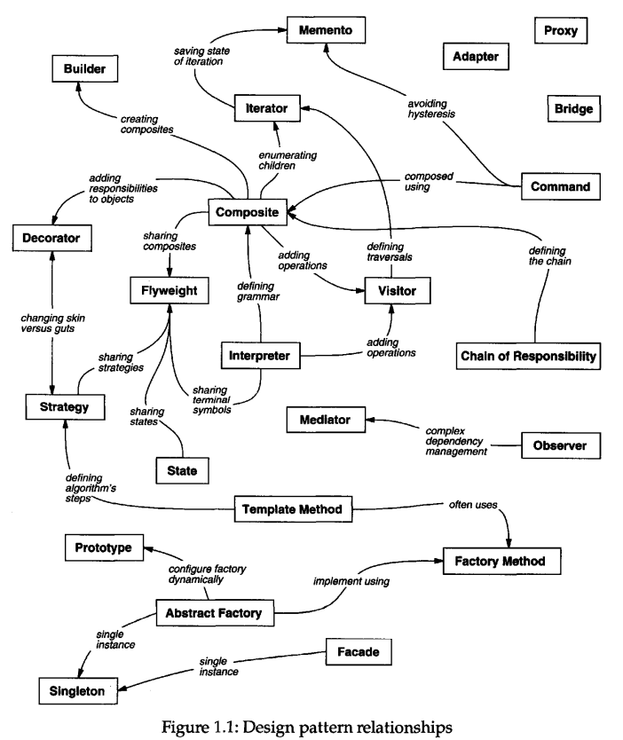
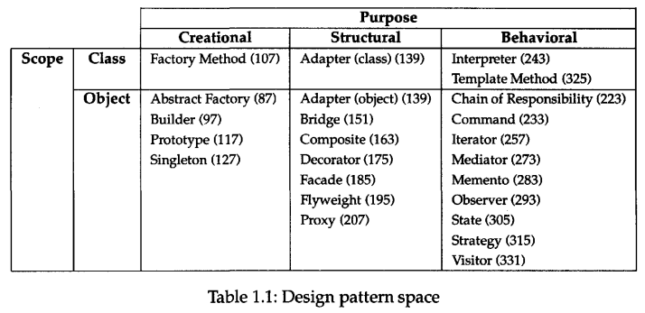

# Design Patterns

- Design pattern notes
- Primarily from Gang of Four's (GoF) _Design Patterns: Elements of Reusable Object-Oriented Software_

## Index

- [Index](#index)
- [Overview](#overview)
- [4 Essential Elements of a Design Pattern](#4-essential-elements-of-a-design-pattern)
- [Pattern Categories](#pattern-categories)
- [Pattern List](#pattern-list)
- [Pattern Relationships](#pattern-relationships)
- [Pattern Table](#pattern-table)
- [Redesign Causes Solved by Patterns](#redesign-causes-solved-by-patterns)

## Overview

- > A design pattern systematically names, motivates, and explains a general design that addresses a recurring design problem in object-oriented systems. It describes the problem, the solution, when to apply the solution, and its consequences. It also gives implementation hints and examples. The solution is a general arrangement of objects and classes that solve the problem. The solution is customized and implemented to solve the problem in a particular context.
  - _Design Patterns: Elements of Reusable Object-Oriented Software_
- > In fact, we think it's unlikely that there will ever be a complete pattern language for software. But it's certainly possible to make one that is more complete. Additions would have to include frameworks and how to use them, patterns for user interface design, analysis patterns, and all the other aspects of developing software. Design patterns are just a part of a larger pattern language for software.
  - _Design Patterns: Elements of Reusable Object-Oriented Software_
- Christopher Alexander
  - Architect who studied patterns in buildings and communities and developed a "pattern language" for generating them
  - Inspired GoF
  - > Each pattern describes a problem which occurs over and over again in our environment, and then describes the core of the solution to that problem, in such a way that you can use this solution a million times over, without ever doing it the same way twice.

## 4 Essential Elements of a Design Pattern

- Pattern name
  - A description of a design problem, its solutions, and consequences in a word or two
- Problem
  - A description of when to apply the pattern
- Solution
  - Elements that make up the design, their relationships, responsibilities, and collaborators
- Consequences
  - All design patterns have trade-offs
  - A pattern should be injected when it truly simplifies a design, provided you follow modern software practices described by SOLID principles, TDD, and Robert Martin's _Clean Code_, etc

## Pattern Categories

- Creational
  - Concern an object's creation
- Structural
  - Deal w/ the composition of classes or objects
- Behavioral
  - Characterize the way in which classes or objects interact/distribute responsibility

## Pattern List

- **Creational**
  - **Abstract Factory**
    - Aka: kit
    - OOP & C (function pointers / structs of function pointers)
    - Relevant post SOLID/_Clean Code_
    - Problem:
      - Families of related objects objects need to be created without binding to concrete classes
    - Solution:
      - A factory interface creates families; concrete factories supply implementations
      - ...so encapsulating a lower level layer w/ dependency inversion into a "factory" class
    - Trade-offs:
      - Flexible/testable, but adds layers of abstraction
  - **Builder**
    - OOP & C (step-wise init functions)
    - Relevant post SOLID/_Clean Code_; sometimes replaced by fluent APIs or object initializers
    - Problem:
      - Constructing complex objects require many steps/options
    - Solution:
      - Encapsulate construction steps, and separate construction from representation
    - Trade-offs:
      - Clearer construction, but more boilerplate
  - **Factory Method**
    - Aka: virtual constructor
    - OOP (via virtual functions and subclassing)
    - Relevant post SOLID/_Clean Code_; may be redundant if there's a tool that automates dependency injection
    - Problem:
      - Base class can't anticipate which subclass to instantiate (there's a need for an instance of a generic class that encapsulates a collection of classes)
    - Solution:
      - Define a creation method, but let subclasses decide what gets created
    - Trade-offs:
      - Flexible instantiation, but forces subclassing
  - **Prototype**
    - OOP & C (structs w/ function pointers imitating a class)
    - ...not too relevant anymore w/ serializers (as seen in OS's to transmit data structures) or copy-constructors (C++: special constructor that initializes new object as a copy of an existing object)
    - Problem:
      - Creating a new object is expensive/complex
    - Solution:
      - Clone existing prototypes
    - Trade-offs:
      - Efficient cloning, but adds deep/shallow copy complexity
  - **Singleton**
    - OOP & C (global w/ controlled access)
    - ...now an anti-pattern- _Working Effectively with Legacy Code_ goes into depth to tackle singletons
    - Problem:
      - Need exactly one instance that's globally accessible
    - Solution:
      - ...ensure controlled global access to instance
    - Trade-offs:
      - Breaks testability and increases coupling
- **Structural**
  - **Adapter**
    - Aka: wrapper
    - OOP & C (wrapper functions)
    - Relevant post SOLID/_Clean Code_
    - Problem:
      - Incompatible interfaces need to collaborate
    - Solution:
      - Wrap/adapt one interface to another
    - Trade-offs:
      - Enables reuse, but adds indirection
  - **Bridge**
    - Aka: handle/body
    - OOP & C (function pointers / structs of function pointers)
    - Relevant post SOLID/_Clean Code_
    - Problem:
      - Need to vary abstraction and implementation independently
    - Solution:
      - Decouple via interface pointer to implementation
      - ...so a one-off abstract factory- aka dependency inversion
    - Trade-offs:
      - Flexible, but more complexity in class design
  - **Composite**
    - OOP & C (tree structure of structs...)
    - Relevant post SOLID/_Clean Code_- good for GUI elements and file systems
    - Problem:
      - Need uniform treatment of single objects and object groups
    - Solution:
      - Use a tree w/ leaf/composite nodes sharing an interface
    - Trade-offs:
      - Simplifies the interface for clients, but makes constraints (class changes) harder
  - **Decorator**
    - Aka: wrapper
    - OOP & C (chaining function wrappers)
    - Relevant post SOLID/_Clean Code_
    - Problem:
      - Need to extend functionality without a subclass explosion
    - Solution:
      - Wrap objects dynamically w/ added behavior
    - Trade-offs:
      - Flexible, but creates a bunch of small objects
  - **Facade**
    - OOP & C (wrapper APIs)
    - Relevant post SOLID/_Clean Code_
    - Problem:
      - Subsystem is too complex for clients
    - Solution:
      - Provide a simplified/unified interface
    - Trade-offs:
      - Easier usage, but can hide functionality
  - **Flyweight**
    - OOP & C (object pools)
    - ...less relevant w/ modern memory/storage, but useful for high-performance cases (games, GUI)
    - Problem:
      - Too many objects w/ repeated intrinsic state wastes memory
    - Solution:
      - Share intrinsic state, and externalize extrinsic state
    - Trade-offs:
      - Saves memory, but adds a complex state management layer
  - **Proxy**
    - Aka: surrogate
    - OOP & C (function wrappers, opaque handles (aka a reference to some internal resource/object that doesn't expose internal structure))
    - Relevant post SOLID/_Clean Code_- ie remote proxies, virtual proxies
    - Problem:
      - Need controlled/indirect access to objects
    - Solution:
      - Provide a stand-in object w/ the same interface
    - Trade-offs:
      - Provides access, but adds indirection and latency
- **Behavioral**
  - **Chain of Responsibility**
    - OOP & C (linked list of function pointers)
    - ...often replaced by modern event pipelines and middleware frameworks
    - Problem:
      - Multiple handlers may process a request, where all handlers have a dependency on the receiver
    - Solution:
      - Pass the request along a chain of handlers
    - Trade-offs:
      - Decouples sender/receiver, but handling order isn't made clear
  - **Command**
    - Aka: action, transaction
    - OOP & C (function pointers as commands)
    - Relevant post SOLID/_Clean Code_- good for GUIs and event-driven systems
    - Problem:
      - Need to encapsulate requests and maintain scalability to add new requests
    - Solution:
      - Wrap requests as command objects
    - Trade-offs:
      - Decouples sender/receiver, but adds a bunch of small classes
  - **Interpreter**
    - OOP & C (parsers, AST ("abstract syntax tree", a tree representation of source code) interpreters)
    - ...mostly replaced by parser generators, but useful in DSLs ("domain-specific language"- SQL, CSS, CMake, etc)
    - Problem:
      - Need to interpret sentences in a language defined by grammar
    - Solution:
      - Represent grammar rules as class hierarchy, and interpret recursively
    - Trade-offs:
      - Good for simple grammars, but doesn't scale well...
  - **Iterator**
    - Aka: cursor
    - OOP & C (index-based iteration, function-based traversal)
    - ...built into modern languages now, so explicit pattern less abundant
    - Problem:
      - Need to traverse a collection without exposing internals
    - Solution:
      - Provide an interator object w/ a standard interface
    - Trade-offs:
      - Simplifies traversal, but adds boilerplate in languages that don't have the native support
  - **Mediator**
    - OOP & C (central dispatcher functions)
    - Relevant post SOLID/_Clean Code_- good for message buses, event hubs
    - Problem:
      - Too many direct dependencies between peers
    - Solution:
      - A central mediator handles communication
    - Trade-offs:
      - Reduces coupling, but everything is coupled a complex the mediator...
  - **Memento**
    - Aka: token
    - OOP & C (state snapshots as structs)
    - Relevant post SOLID/_Clean Code_- good for undo/rollback
    - Problem:
      - Need to capture object state without breaking encapsulation
    - Solution:
      - Store state externally as a memento object
    - Trade-offs:
      - Maintains encapsulation, but adds memory overhead
  - **Observer**
    - Aka: dependents, publish-subscribe
    - OOP & C (callback lists, event listeners)
    - Relevant post SOLID/_Clean Code_- good for pub/sub, events
    - Problem:
      - Dependents need to react to subject's change automatically
    - Solution:
      - Subject keeps observer list, and notifies on change
    - Trade-offs:
      - Decouples subject/observers, but notifications are hard to manage
  - **State**
    - Aka: objects for states
    - OOP & C (function pointer state tables)
    - Relevant post SOLID/_Clean Code_
    - Problem:
      - Object behavior changes w/ internal state, causing conditionals everywhere
    - Solution:
      - Encapsulate states as classes/handlers, and delegate behavior
    - Trade-offs:
      - Removes conditionals, but adds class explosion
  - **Strategy**
    - Aka: policy
    - OOP & C (function pointers as strategies)
    - Relevant post SOLID/_Clean Code_- good for algorithm families, sorting policies, etc
    - Problem:
      - Need to switch between algorithms without changing clients
    - Solution:
      - Encapsulate algorithms as interchangeable objects
    - Trade-offs:
      - Flexible, but requires strategy selection logic
  - **Template Method**
    - OOP (via inheritance)
    - ...replaced by composition and higher-order functions
    - Problem:
      - Algorithms share structure but differ in steps
    - Solution:
      - Base class defines a skeleton; subclasses override steps
    - Trade-offs:
      - Promotes reuse, but introduces inheritance
  - **Visitor**
    - OOP & C (function tables, but rather excessive)
    - Relevant post SOLID/_Clean Code_
    - Problem:
      - Need new operations without changing class hierarchies
    - Solution:
      - Visitor class encapsulates new operations, and existing objects accept visitors
    - Trade-offs:
      - Easy to add new operations, but makes it harder to introduce new types

## Pattern Relationships

- 

## Pattern Table

- 

## Redesign Causes Solved by Patterns

- Most causes of redesign are glaring violations of SOLID principles, where design patterns may or may not be the simplest solution to the problem
- ... When the issues aren't your fault and you don't have control over implementation, design patterns greatly help alleviate the mess
- Creating an object by specifying a class explicitly
  - Hardcoded uses of a particular class is inhibiting scalability
  - Lack of dependency inversion, lack of proper encapsulation
  - Suggested patterns:
    - Abstract factory
    - Factory method
    - Prototype
- Dependence on specific operations
  - Hardcoded requests are preventing feature additions/changes
  - Single responsibility principle violation, open-close principle violation
  - Suggested patterns:
    - Chain of responsibility
    - Command
- Dependence on hardware and software platforms
  - Lack of dependency inversion
  - Suggested patterns:
    - Abstract factory
    - Bridge
- Dependence on object representation or implementations
  - Rigid object representation, storage, location, implementation are inhibiting scalability
  - Liskov substitution principle violation, open-close principle violation, lack of proper encapsulation
  - Suggested patterns:
    - Abstract factory
    - Bridge
    - Memento
    - Proxy
- Algorithmic dependencies
  - Rigid algorithm implementations preventing feature additions/changes
  - Open-closed principle violation, lack of proper encapsulation
  - Suggested patterns:
    - Builder
    - Iterator
    - Strategy
    - Template method
    - Visitor
- Tight coupling
  - Dependency between two classes preventing feature additions/changes
  - Single responsibility principle violation, open-closed principle violation, lack of proper encapsulation
  - Suggested patterns:
    - Abstract factory
    - Bridge
    - Chain of responsibility
    - Command
    - Facade
    - Mediator
    - Observer
- Extending functionality by subclassing
  - Subclassing is a neat feature of OOP, but creates large classes that do too much
  - Single responsibility principle violation
  - Suggested patterns:
    - Bridge
    - Chain of responsibility
- Inability to alter classes conveniently
  - Working w/ a legacy codebase, code that doesn't exist yet, or large libraries
  - In other words, when it's not your fault- _Working Effectively with Legacy Code_ reiterates design pattern solutions
  - Suggested patterns:
    - Adapter
    - Decorator
    - Visitor
